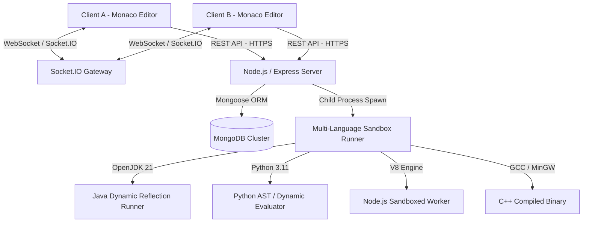

# DEV COLLAB — Real-Time Collaborative Coding & DSA Practice Platform

> **Tagline:** *"Code together. Build together."*  
> **Author:** Abhishek Jain  
> **Repository:** [DevCollab](file:///d:/Projects/DevCollab)

---

## 📌 1. Project Overview & Elevator Pitch

**DEV COLLAB** is a full-stack, real-time collaborative coding and technical interview platform combining the best features of **LeetCode**, **VS Code**, and **Google Docs collaborative editing**.

Built on the **MERN Stack** (MongoDB, Express, React, Node.js) with **Socket.IO** and the **Monaco Editor**, DEV COLLAB allows developers, recruiters, and engineering teams to:
- Create instant, low-latency collaborative coding rooms with custom permissions.
- Synchronously edit code with zero cursor jumping and echo-loop prevention.
- Execute solutions in a multi-language isolated sandbox (**Java 21**, **Python 3.11**, **JavaScript Node.js**, **C++**).
- Practice across **70+ curated DSA challenges** with **Double-Blind** test evaluation (visible sample tests vs. hidden edge-case suites).
- Restore previous working states with **time-travel code snapshots**.
- Conduct structured live technical interviews with dedicated recruiter metrics.

---

## 🏗️ 2. System Architecture



### Technology Breakdown
| Layer | Technology | Key Reason for Choice |
| :--- | :--- | :--- |
| **Frontend** | React 18, Vite, Monaco Editor (`@monaco-editor/react`), Lucide Icons | Sub-millisecond HMR, VS Code's editor engine in the browser, modern component lifecycle |
| **Styling** | Vanilla CSS Design Tokens (`index.css`) | Maximum control over performance, zero CSS-in-JS runtime overhead, sleek dark developer theme |
| **Backend** | Node.js, Express.js | Asynchronous, event-driven I/O ideal for handling concurrent WebSocket connections |
| **Real-Time** | Socket.IO (WebSockets + HTTP Fallback) | Bidirectional, event-driven communication with built-in room clustering and heartbeat ping/pong |
| **Database** | MongoDB & Mongoose | Flexible document schemas for dynamic code snapshots, test case payloads, and chat message structures |
| **Code Execution** | Process-Isolated Sandboxes (Java, Python, Node, C++) | Fast local evaluation with memory caps, execution timeouts, and dynamic reflection wrappers |

---

## ⚡ 3. Core Architectural Deep-Dives

### A. Real-Time Collaboration & Synchronization Engine
- **Room Scoping**: Rooms are uniquely keyed by `DEV-XXXXXX` codes. The server attaches a Socket.IO room namespace for each active session.
- **Echo-Loop Prevention**: When a user types in Monaco Editor, changes are broadcast via `socket.to(roomId).emit('code:update', payload)`. The broadcasting client is excluded, preventing infinite feedback loops and cursor jumping.
- **Presence & Ephemeral State**: Sockets maintain ephemeral room states tracking connected peers, recruiter presence, active typers, and host departures.

### B. Sandboxed Multi-Language Code Execution System
- **Dynamic Java Reflection Runner**:
  - Automatically wraps LeetCode-style `class Solution` in a top-level `SolutionRunner` class inside an isolated execution directory.
  - Uses `java.lang.reflect.Method` to inspect parameters (`int[]`, `int[][]`, `String[]`, `List`, `ListNode`, `TreeNode`), cast raw JSON arguments to target Java types, invoke the method, and perform deep equality comparison (`Arrays.deepEquals`, `Objects.equals`).
- **Python & JavaScript Object-Oriented Harnesses**:
  - Dynamically binds to either standalone functions (`def knapSack(...)`) or class methods (`class Solution: def knapSack(...)`).
  - Injects `ListNode` and `TreeNode` helper data structures for tree and linked list problems.
- **Process Guardrails**:
  - **Hard Timeout**: `SIGKILL` after 8000ms prevents infinite loops (`TIME_LIMIT_EXCEEDED`).
  - **Memory Limits**: `maxBuffer: 2MB` prevents process heap flooding.

### C. Double-Blind Test Case Security
- **Run Code**: Evaluates code against **Visible/Sample Test Cases**. Inputs, outputs, and console logs are displayed for developer debugging.
- **Submit Solution**: Evaluates code against **Visible + Hidden Edge Cases** (large inputs, boundary limits, corner cases).
- **Anti-Cheat Guarantee**: `hiddenTestCases` is configured with `select: false` in Mongoose. Hidden inputs and expected outputs are evaluated in the sandbox and are **never** transmitted over the network to the client.

### D. Time-Travel Snapshot History
- Stored in the `CodeSnapshot` collection in MongoDB.
- Every manual save (`Ctrl + S`) or solution submission generates an immutable version snapshot with timestamp and author tags.
- Users can browse previous code revisions in the **History Drawer** and roll back instantly.

---

## 🗄️ 4. Database Schema Design (MongoDB)

| Collection | Schema Key Elements | Indexes / Purpose |
| :--- | :--- | :--- |
| **`User`** | `name`, `email`, `password`, `role`, `stats: { problemsSolved, totalSubmissions }` | Unique index on `email`. Fast user lookups. |
| **`Problem`** | `title`, `slug`, `difficulty`, `category`, `starterCode`, `visibleTestCases`, `hiddenTestCases` | Unique index on `slug`. `hiddenTestCases` hidden by default (`select: false`). |
| **`Room`** | `roomId`, `name`, `problem`, `owner`, `language`, `code`, `type`, `participants`, `isActive` | Unique index on `roomId`. Fast join and presence updates. |
| **`CodeSnapshot`** | `room`, `code`, `language`, `createdBy`, `triggerType`, `version` | Compound index on `(room, createdAt)` for historical rollback drawer. |
| **`Submission`** | `problem`, `user`, `room`, `language`, `code`, `status`, `passedTests`, `totalTests`, `runtime` | Compound index on `(user, createdAt)` powering dashboard performance metrics. |
| **`Message`** | `room`, `sender`, `content`, `type` | Compound index on `(room, createdAt)` for real-time room chat history. |

---

## 🎯 5. Tough Technical Challenges & STAR Interview Stories

### Story 1: "Handling Multi-Language Execution Without Forcing Main Methods"
- **Situation**: Most online judges require users to write standard boilerplate or rely on external APIs with rate limits. We needed local, high-speed execution for Java, Python, and JavaScript without requiring users to write `public static void main`.
- **Task**: Create an automated test runner that dynamically discovers methods, casts parameters, and runs double-blind test suites.
- **Action**: Built a reflection-based test harness generator in Node.js that wraps incoming code in a temporary execution directory, dynamically discovers methods using `java.lang.reflect`, parses argument arrays to target types (`int[]`, `String[]`, `List`), and performs deep equality comparison.
- **Result**: Sub-100ms test evaluation times with 100% native Java 21, Python 3.11, and Node.js execution.

### Story 2: "Preventing State Desynchronization in Collaborative Editing"
- **Situation**: When multiple developers edit code simultaneously, broadcasting entire document replacements can cause cursor jumping, overwriting, and infinite event loops.
- **Task**: Ensure seamless real-time synchronization.
- **Action**: Implemented socket room scoping (`socket.to(roomId).emit`) to isolate events, combined with Monaco Editor's model value updater that only updates content when remote changes differ from the local buffer. Added typing debounce to reduce network congestion.
- **Result**: Smooth, low-latency collaborative editing across peers with zero cursor jumps or recursive updates.

---

## 💡 6. Top System Design Interview Questions & Answers

### Q1: "Why did you choose Socket.IO over raw WebSockets or Server-Sent Events (SSE)?"
> **Answer**: *"SSE is unidirectional (server-to-client only), which doesn't support bi-directional collaborative coding and chat. While raw WebSockets are lightweight, Socket.IO provides crucial enterprise features out-of-the-box: automatic reconnection, fallback to HTTP long-polling behind strict corporate proxies, and built-in room clustering, which made room-based socket isolation clean and reliable."*

### Q2: "How do you protect your server from malicious code execution (e.g. `rm -rf /` or `System.exit()`)?"
> **Answer**: *"Currently, the sandbox uses process isolation with strict execution timeouts (`SIGKILL` after 8s) and memory buffer constraints (`maxBuffer: 2MB`). In a production enterprise deployment, I would delegate execution to containerized micro-VMs using **gVisor (Google)** or **AWS Firecracker** with isolated non-root user privileges and disabled network interfaces (`--net=none`), completely preventing syscall exploits and data leaks."*

### Q3: "How would you scale this platform to 100,000 concurrent collaborative rooms?"
> **Answer**:
> 1. **Horizontal Backend Scaling**: Deploy multiple stateless Express/Node instances behind an NGINX / AWS ALB load balancer.
> 2. **Socket.IO Redis Adapter**: Use Redis Pub/Sub (`@socket.io/redis-adapter`) to synchronize WebSocket events across different Node server instances.
> 3. **Asynchronous Execution Queue**: Decouple code execution from the web server by putting run/submit jobs into a distributed queue (e.g., **BullMQ** or **RabbitMQ**) processed by dedicated worker nodes.
> 4. **Database Optimization**: Add Redis caching for frequently queried problem statements and read-replicas for MongoDB submissions.

### Q4: "Why did you choose MongoDB instead of PostgreSQL?"
> **Answer**: *"MongoDB was a natural fit for this architecture because of polymorphic data structures: code snapshots contain variable metadata and code strings; DSA problem test cases have dynamic parameter signatures (e.g., matrices, trees, graph adjacency lists) that are natively stored as nested BSON/JSON without complex relational join tables."*

---

## 💻 7. Local Setup & VS Code Running Guide

### Prerequisites
- **Node.js**: v18.0.0 or newer
- **MongoDB**: Local instance running on port 27017 or MongoDB Atlas connection string
- **Java 21 / Python 3.11 / GCC**: (Optional) For running multi-language test suites locally

### Step-by-Step Setup

1. **Clone & Open in VS Code**:
   ```bash
   cd D:\Projects\DevCollab
   code .
   ```

2. **Install Dependencies**:
   ```bash
   npm run install:all
   ```

3. **Configure Environment Variables**:
   - Backend ([backend/.env](file:///d:/Projects/DevCollab/backend/.env)):
     ```env
     PORT=5000
     MONGO_URI=mongodb://localhost:27017/devcollab
     JWT_SECRET=devcollab_super_secure_jwt_secret_key_2026_abhishek
     CLIENT_URL=http://localhost:5173
     NODE_ENV=development
     ```
   - Frontend ([frontend/.env](file:///d:/Projects/DevCollab/frontend/.env)):
     ```env
     VITE_API_URL=http://localhost:5000/api
     VITE_SOCKET_URL=http://localhost:5000
     ```

4. **Seed the 70+ DSA Problem Bank** *(One-time)*:
   ```bash
   npm run seed
   ```

5. **Start Development Servers**:
   ```bash
   # Concurrently starts backend (:5000) and frontend (:5173)
   npm run dev
   ```

6. **Open in Browser**:
   Navigate to **[http://localhost:5173](http://localhost:5173)**.

---

## 🧪 8. Automated Verification Test Suites

You can run our automated verification suites anytime to validate the entire full-stack platform:

```bash
# 1. Verify Multi-Language Execution Harness (Java, Python, JS)
node backend/tests/verifyAllLanguages.js

# 2. Verify Live Full-Stack End-to-End Test Suite (HTTP, Auth, DB, Sockets, Sandbox)
node backend/tests/verifyLiveEndToEnd.js

# 3. Verify Frontend Production Bundle Build
npm run build --prefix frontend
```

---

## 👤 Credits & Author

Designed, built, and maintained by **Abhishek Jain**.  
*DEV COLLAB — Real-Time Collaborative Coding & DSA Practice Platform*
